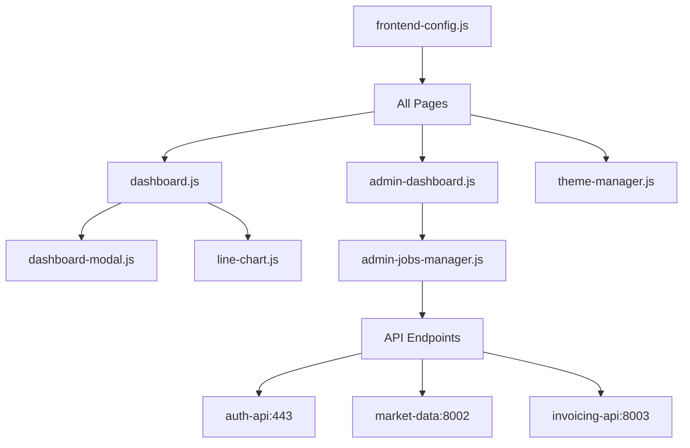
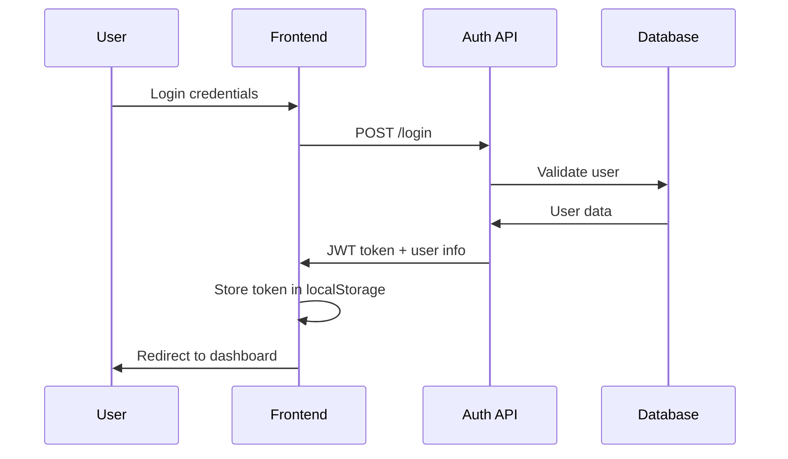

# ROO7 Trading Platform - Administrator Documentation

Complete technical reference for system administrators, developers, and technical staff managing the ROO7 trading platform frontend.

## Table of Contents

1. [Architecture Overview](#architecture-overview)
2. [Configuration System](#configuration-system)
3. [Authentication & Security](#authentication--security)
4. [Admin Dashboard](#admin-dashboard)
5. [Jobs Manager](#jobs-manager)
6. [API Integration](#api-integration)
7. [Development Setup](#development-setup)
8. [Deployment & Maintenance](#deployment--maintenance)
9. [Troubleshooting](#troubleshooting)

---

## Architecture Overview

### Frontend Structure

```
frontend/roo7-site/
├── HTML Pages
│   ├── auth.html              # Authentication portal
│   ├── dashboard.html         # User main dashboard
│   ├── admin-dashboard.html   # Admin overview
│   ├── admin-users.html       # User management
│   ├── admin-accounts.html    # Account management
│   ├── admin-jobs-manager.html # Jobs control panel
│   ├── invoices.html          # Invoice management
│   ├── referrals.html         # Referral system
│   ├── troubleshoot.html      # Account diagnostics
│   ├── market-insights.html   # Market data viewer
│   ├── landingpage.html       # Marketing page
│   └── index.html             # Home redirect
│
├── JavaScript Modules
│   ├── frontend-config.js     # Centralized configuration
│   ├── dashboard.js           # Main dashboard logic
│   ├── dashboard-modal.js     # Modal management system
│   ├── admin-dashboard.js     # Admin dashboard logic
│   ├── admin-users.js         # User management logic
│   ├── admin-accounts.js      # Account management logic
│   ├── admin-jobs-manager.js  # Jobs manager interface
│   ├── theme-manager.js       # Theme switching system
│   ├── line-chart.js          # Chart visualization
│   ├── pie-chart.js           # Pie chart component
│   ├── invoices.js            # Invoice management
│   ├── referrals.js           # Referral system logic
│   ├── troubleshoot.js        # Troubleshoot interface
│   └── logger.js              # Client-side logging
│
├── CSS Stylesheets
│   ├── dashboard.css          # Main styling
│   ├── admin-dashboard.css    # Admin-specific styles
│   ├── admin-jobs-manager.css # Jobs manager styling
│   └── auth.css               # Authentication styling
│
└── Documentation
    ├── frontend.md            # User documentation
    └── frontend_admin.md      # This file
```

### Component Relationships



---

## Configuration System

### Central Configuration
**File**: `frontend-config.js`

This is the single source of truth for all frontend configuration:

```javascript
// Brand Configuration
BRAND_CONFIG = {
    name: "ROO7",
    fullName: "ROO7 Automated Trading Platform",
    colors: { primary: "#3498db", secondary: "#2c3e50", ... },
    messaging: { welcome: "Welcome to ROO7...", ... }
}

// Domain Configuration
DOMAIN_CONFIG = {
    primary: "roo7.site",
    api: "api.roo7.site",
    ports: { api: "8003", auth: "443", market: "8002" }
}

// API Configuration
API_CONFIG = {
    baseUrl: "https://api.roo7.site:443",
    endpoints: { login: "/login", accounts: "/accounts", ... }
}

// Feature Flags
FEATURE_FLAGS = {
    newInvoiceFlow: true,
    autoTroubleshoot: true,
    debugMode: false
}
```

### Configuration Usage

Every page imports and uses central configuration:
```javascript
import CONFIG from './frontend-config.js';

// API calls use centralized URLs
const API_BASE = CONFIG.API_CONFIG.authUrl;
const response = await fetch(`${API_BASE}/accounts`);

// Branding uses centralized values
document.title = CONFIG.PAGE_CONFIG.titles.dashboard;
```

### Environment Management

**Development vs Production**:
- Configuration handles different environments
- Feature flags control rollout
- Debug mode enables verbose logging

---

## Authentication & Security

### Authentication Flow



### Token Management

**Storage**: `localStorage.setItem('token', jwt_token)`
**Usage**: All API calls include `Authorization: Bearer ${token}`
**Validation**: Automatic redirect to auth.html if token invalid
**Expiry**: Auto-logout when token expires

### Security Features

#### Cloudflare Turnstile Integration
```html
<div class="cf-turnstile" data-sitekey="0x4AAAAAABo9zZnReMKrbMti"></div>
```

#### API Security
- CORS validation against allowed domains
- JWT token validation on all requests
- Rate limiting on sensitive endpoints
- HTTPS-only communication

#### Client-side Security
- No sensitive data in client storage
- API keys encrypted before transmission
- XSS protection through input validation
- CSRF tokens where applicable

### Permission System

**User Roles**:
- `user`: Standard user access
- `admin`: Administrative privileges
- `super_admin`: Full system access

**Role Checking**:
```javascript
const userData = JSON.parse(localStorage.getItem('userData'));
if (userData.is_admin) {
    document.getElementById('admin-btn').style.display = 'block';
}
```

---

## Admin Dashboard

**Page**: `admin-dashboard.html`
**Script**: `admin-dashboard.js`

### Admin Interface Layout

#### System Overview Section
- **Real-time Statistics**: Active users, total accounts, system health
- **Performance Metrics**: API response times, error rates
- **Resource Usage**: Server load, database connections
- **Refresh Controls**: Manual and auto-refresh options

#### User Management Section
- **Active Users**: Currently logged-in users
- **Recent Registrations**: New user signups
- **User Actions**: Quick user lookup and management
- **Tier Upgrades**: Pending subscription changes

#### Account Management Section
- **Active Trading Accounts**: Accounts with strategies
- **Account Statistics**: Total value, distribution by exchange
- **Problem Accounts**: Accounts with issues
- **Batch Operations**: Mass account operations

#### Administrative Controls Section
- **System Controls**: Start/stop services, maintenance mode
- **Data Management**: Database operations, backups
- **Security Monitoring**: Failed login attempts, suspicious activity
- **Navigation**: Links to specialized admin pages

### Admin API Endpoints

```javascript
// System Overview
GET /admin/dashboard/summary
GET /admin/dashboard/activity

// User Management  
GET /admin/users/search?q={query}
POST /admin/users/{userId}/action

// Account Management
GET /admin/accounts
PUT /admin/accounts/{accountId}
DELETE /admin/accounts/{accountId}

// Tier Management
GET /admin/tier-upgrades/pending
POST /admin/tier-upgrades/scan
```

### Admin-Specific Features

#### Source Account Creation
- **Batch Account Creation**: Create multiple accounts at once
- **Exchange Integration**: Support for Binance, Bybit, OKX
- **Strategy Assignment**: Automated strategy deployment
- **Validation**: Real-time API key validation

#### User Administration
- **User Search**: Find users by username, email, or ID
- **Account Linking**: View all accounts for a user
- **Permission Management**: Grant/revoke admin access
- **Activity Monitoring**: Track user actions and changes

---

## Jobs Manager

**Page**: `admin-jobs-manager.html`
**Script**: `admin-jobs-manager.js`

### Jobs Manager Interface

#### Jobs Manager Status
- **Service Health**: Running status, uptime, worker ID
- **Cycle Statistics**: Completed cycles, last cycle time
- **Job Statistics**: Total processed, success/failure rates
- **Performance Metrics**: Average execution time, queue depth

#### Active Jobs Summary
- **Job Counts by Status**: Active, disabled, revoked, stale
- **Run Status Distribution**: Idle, due, running, succeeded, failed
- **Resource Usage**: Memory, CPU utilization
- **Error Rates**: Recent failure statistics

#### Active Jobs List
- **Real-time Job Status**: Current state of all active jobs
- **Account Details**: Name, exchange, strategy, value
- **Execution History**: Last run time, success rate
- **Job Controls**: Force execution, pause, resume, disable

#### Job Execution History
- **Execution Records**: Detailed log of job runs
- **Filtering Options**: By account, status, time range
- **Performance Data**: Duration, success/failure details
- **Export Options**: CSV download for analysis

#### Audit Changes Log
- **Change Tracking**: All modifications to active jobs
- **Change Types**: Job created, config changed, status changed
- **Audit Trail**: Who, what, when, why for each change
- **Detailed Analysis**: Before/after comparisons

### Jobs Manager API Integration

```javascript
// Jobs Manager Status
GET /admin/jobs-manager/status
GET /admin/jobs-manager/dashboard

// Active Jobs Management
GET /admin/jobs-manager/active-jobs
POST /admin/jobs-manager/force-execution/{accountId}
POST /admin/jobs-manager/pause/{accountId}
POST /admin/jobs-manager/resume/{accountId}

// Job Execution History
GET /admin/jobs-manager/job-executions
GET /admin/jobs-manager/job-executions/{accountId}

// Audit System
GET /admin/jobs-manager/audit-changes
```

### Advanced Features

#### Real-time Monitoring
- **Auto-refresh**: Configurable refresh intervals
- **Live Updates**: WebSocket-like polling for real-time data
- **Status Indicators**: Color-coded status indicators
- **Alert System**: Visual alerts for critical issues

#### Batch Operations
- **Multi-account Actions**: Perform actions on multiple accounts
- **Bulk Job Control**: Start/stop multiple jobs simultaneously
- **Mass Configuration**: Apply settings to job groups
- **Scheduled Maintenance**: Plan and execute maintenance windows

#### Performance Analytics
- **Execution Trends**: Job performance over time
- **Success Rates**: Statistical analysis of job success
- **Resource Utilization**: System resource usage patterns
- **Predictive Analysis**: Forecast resource needs

---

## API Integration

### Backend Services Architecture

```
┌─────────────────┐    ┌─────────────────┐    ┌─────────────────┐
│   auth-api      │    │market-data-svc │    │ invoicing-api   │
│   Port: 443     │    │   Port: 8002    │    │   Port: 8003    │
│                 │    │                 │    │                 │
│ • Authentication│    │ • Market data   │    │ • Invoice gen   │
│ • User mgmt     │    │ • Price feeds   │    │ • Payment proc  │
│ • Account mgmt  │    │ • Analytics     │    │ • Billing logic │
│ • Jobs manager  │    │ • Charts data   │    │ • Referrals     │
│ • Admin funcs   │    │ • Top movers    │    │ • Tier mgmt     │
└─────────────────┘    └─────────────────┘    └─────────────────┘
        │                       │                       │
        └───────────────────────┼───────────────────────┘
                                │
                    ┌─────────────────┐
                    │    Frontend     │
                    │   roo7.site     │
                    │                 │
                    │ • User interface│
                    │ • Admin panels  │
                    │ • API clients   │
                    │ • State mgmt    │
                    └─────────────────┘
```

### API Client Implementation

#### Authenticated Requests
```javascript
async function makeAuthenticatedRequest(url, options = {}) {
    const token = localStorage.getItem('token');
    if (!token) throw new Error('No authentication token');
    
    const response = await fetch(url, {
        ...options,
        headers: {
            'Authorization': `Bearer ${token}`,
            'Content-Type': 'application/json',
            ...options.headers
        }
    });
    
    if (response.status === 401) {
        localStorage.removeItem('token');
        window.location.href = '/auth.html';
        return;
    }
    
    return response;
}
```

#### Error Handling
```javascript
try {
    const response = await makeAuthenticatedRequest(url);
    const data = await response.json();
    
    if (!response.ok) {
        throw new Error(data.message || `HTTP ${response.status}`);
    }
    
    return data;
} catch (error) {
    console.error('API Error:', error);
    showToast(`Error: ${error.message}`, 'error');
    throw error;
}
```

### API Endpoint Reference

#### Authentication API (auth-api:443)
```javascript
// Authentication
POST /login                    // User login
POST /register                 // User registration
POST /logout                   // User logout
POST /verify-email             // Email verification
POST /reset-password           // Password reset

// User Management
GET  /users/me                 // Get current user
PUT  /users/update             // Update user profile
GET  /users/{userId}           // Get specific user (admin)

// Account Management
GET    /accounts               // List user accounts
POST   /accounts               // Create new account
PUT    /accounts/{accountId}   // Update account
DELETE /accounts/{accountId}   // Delete account
POST   /troubleshoot/{accountId} // Troubleshoot account

// Admin Functions
GET /admin/dashboard/summary   // System overview
GET /admin/users/search        // Search users
GET /admin/accounts            // All accounts (admin)

// Jobs Manager
GET  /admin/jobs-manager/status              // Jobs service status
GET  /admin/jobs-manager/active-jobs         // Active jobs list
GET  /admin/jobs-manager/job-executions      // Job history
POST /admin/jobs-manager/force-execution     // Force job run
POST /admin/jobs-manager/pause/{accountId}   // Pause job
POST /admin/jobs-manager/resume/{accountId}  // Resume job
GET  /admin/jobs-manager/audit-changes       // Audit log
```

#### Market Data API (market-data:8002)
```javascript
// Market Data
GET /market/data               // Current market data
GET /market/analytics          // Market analytics
GET /market/top-movers         // Top gainers/losers
GET /spot-instruments          // Available trading symbols
```

#### Invoicing API (invoicing-api:8003)
```javascript
// Invoice Management
GET  /invoices/me              // User invoices
POST /invoices/request         // Request new invoice
GET  /invoices/{invoiceId}     // Get specific invoice
POST /invoices/calculate-pricing // Calculate pricing

// Referral System
GET  /referrals/me             // User referrals
POST /referrals/generate-code  // Generate referral code
POST /referrals/validate-code  // Validate referral code

// Admin Functions
GET /admin/invoices            // All invoices (admin)
GET /admin/referrals           // All referrals (admin)
```

---

## Development Setup

### Prerequisites
- Modern web browser with developer tools
- Text editor/IDE (VS Code recommended)
- Local web server (Live Server, Python http.server, etc.)
- Git for version control

### Local Development

#### 1. Environment Setup
```bash
# Clone repository
git clone <repository-url>
cd frontend/roo7-site

# Start local server
python3 -m http.server 8080
# or use Live Server extension in VS Code

# Access application
open http://localhost:8080
```

#### 2. Configuration for Development
Update `frontend-config.js` for local development:
```javascript
export const DOMAIN_CONFIG = {
    primary: "localhost:8080",
    api: "api.roo7.site",  // Still use production API
    // or
    api: "localhost:8000", // Use local backend if available
}
```

#### 3. Debug Mode
Enable debug mode in configuration:
```javascript
export const FEATURE_FLAGS = {
    debugMode: true,        // Enable verbose logging
    simulateAutoTroubleshoot: true,  // Use simulation
}
```

### File Organization

#### CSS Architecture
```
dashboard.css           # Base styles, variables, layout
├── Variables & Resets
├── Layout System
├── Component Styles
├── Responsive Design
└── Dark/Light Themes

admin-dashboard.css     # Admin-specific extensions
├── Admin Layout
├── Data Tables
├── Action Buttons
└── Status Indicators

admin-jobs-manager.css  # Jobs manager specific
├── Jobs Interface
├── Execution History
├── Audit Logs
└── Real-time Updates
```

#### JavaScript Modules
```
frontend-config.js      # Central configuration
├── Brand config
├── API endpoints
├── Feature flags
└── Utility functions

dashboard.js           # Main dashboard logic
├── Authentication check
├── Account management
├── Strategy assignment
└── Analytics display

dashboard-modal.js     # Modal system
├── Account creation
├── Strategy assignment
├── Form validation
└── API integration
```

### Version Control

#### File Versioning
CSS and JS files use version parameters for cache busting:
```html
<link rel="stylesheet" href="dashboard.css?v=1755439781" />
<script src="dashboard.js?v=8.8"></script>
```

#### Version Update Process
1. Make changes to CSS/JS files
2. Update version number in HTML
3. Test changes
4. Commit to version control
5. Deploy to production

### Testing

#### Browser Testing
- Test in Chrome, Firefox, Safari, Edge
- Test responsive design (mobile, tablet, desktop)
- Test theme switching (light/dark mode)
- Validate API interactions

#### Development Tools
```javascript
// Enable debug logging
localStorage.setItem('debug', 'true');

// View current configuration
console.log(CONFIG);

// Monitor API calls
// Use browser Network tab

// Test authentication
localStorage.getItem('token');
```

---

## Deployment & Maintenance

### Production Deployment

#### File Structure Verification
```
production-server/
├── HTML files (*.html)
├── JavaScript files (*.js)
├── CSS files (*.css)
├── Assets (images, fonts)
└── Configuration files
```

#### HTTPS Configuration
- SSL certificates installed
- HTTP to HTTPS redirect enabled
- CORS headers properly configured
- API endpoints accessible via HTTPS

#### CDN Integration (if applicable)
- Static assets served via CDN
- Cache headers configured
- Cache invalidation process

### Configuration Management

#### Environment-Specific Settings
```javascript
// Production configuration
const isProduction = window.location.hostname === 'roo7.site';

if (isProduction) {
    FEATURE_FLAGS.debugMode = false;
    FEATURE_FLAGS.simulateAutoTroubleshoot = false;
}
```

#### Feature Flag Management
```javascript
// Gradual feature rollout
FEATURE_FLAGS.enableForAllUsers = true;      // Enable for everyone
FEATURE_FLAGS.enableForBetaUsers = true;     // Enable for beta users
```

### Performance Optimization

#### Asset Optimization
- Minify CSS and JavaScript files
- Optimize images (WebP format, compression)
- Enable gzip compression
- Use browser caching headers

#### JavaScript Performance
- Lazy load non-critical JavaScript
- Use efficient DOM queries
- Minimize API calls
- Implement proper error boundaries

#### CSS Performance
- Use efficient selectors
- Minimize CSS file size
- Leverage CSS variables
- Optimize for paint performance

### Monitoring & Analytics

#### Error Tracking
```javascript
window.addEventListener('error', (event) => {
    console.error('Global error:', event.error);
    // Send to error tracking service
});

// API error logging
catch (error) {
    console.error('API Error:', error);
    // Log to monitoring service
}
```

#### Performance Monitoring
- Page load times
- API response times
- User interaction metrics
- Error rates and types

### Backup & Recovery

#### Configuration Backup
- Regular backups of configuration files
- Version control for all changes
- Document configuration dependencies

#### Database Considerations
- Frontend relies on API data
- No local database requirements
- User data stored in localStorage (minimal)

---

## Troubleshooting

### Common Issues

#### Authentication Problems

**Issue**: Users can't login
```javascript
// Debug steps
1. Check network connectivity
2. Verify API endpoint availability
3. Check browser console for errors
4. Validate Cloudflare Turnstile configuration
5. Review API response codes
```

**Issue**: Token expires frequently
```javascript
// Potential causes
- Server clock synchronization
- Token expiration time too short
- Browser timezone issues

// Debug
const token = localStorage.getItem('token');
const payload = JSON.parse(atob(token.split('.')[1]));
console.log('Token expires:', new Date(payload.exp * 1000));
```

#### API Connection Issues

**Issue**: API calls failing
```javascript
// Debug checklist
1. Verify API endpoint URLs in frontend-config.js
2. Check CORS configuration
3. Validate SSL certificates
4. Test API endpoints directly (curl/Postman)
5. Check network connectivity
```

**Issue**: CORS errors
```javascript
// Common causes
- Mismatched domain configuration
- Missing CORS headers on backend
- HTTP vs HTTPS protocol mismatch

// Fix in backend CORS configuration
allow_origin_regex = "^https:\\/\\/(.*\\.)?roo7\\.site$"
```

#### UI/UX Issues

**Issue**: Charts not loading
```javascript
// Debug steps
1. Check browser console for JavaScript errors
2. Verify chart data API responses
3. Check if chart container exists
4. Validate chart library loading

// Common fixes
- Ensure chart container has dimensions
- Verify data format matches expected structure
- Check if chart library CSS is loaded
```

**Issue**: Modal not opening
```javascript
// Debug steps
1. Check if ModalManager is initialized
2. Verify event listeners are attached
3. Check for JavaScript errors in console
4. Validate modal HTML structure

// Common fixes
const modalManager = new window.ModalManager(API_BASE, MARKET_DATA_API);
// Ensure modalManager is available globally
```

#### Performance Issues

**Issue**: Slow page loading
```javascript
// Optimization checklist
1. Optimize image sizes and formats
2. Minify CSS and JavaScript
3. Enable browser caching
4. Use CDN for static assets
5. Lazy load non-critical resources

// Monitoring
console.time('PageLoad');
window.addEventListener('load', () => {
    console.timeEnd('PageLoad');
});
```

**Issue**: High memory usage
```javascript
// Common causes
- Memory leaks in event listeners
- Unreleased object references
- Large datasets in memory

// Prevention
- Remove event listeners when not needed
- Clear intervals and timeouts
- Limit data retention
```

### Debug Tools

#### Console Commands
```javascript
// Configuration inspection
console.log('Config:', CONFIG);

// Authentication status
console.log('Token:', localStorage.getItem('token'));
console.log('User:', JSON.parse(localStorage.getItem('userData') || '{}'));

// API base URLs
console.log('Auth API:', CONFIG.API_CONFIG.authUrl);
console.log('Market API:', CONFIG.API_CONFIG.marketUrl);

// Feature flags
console.log('Features:', CONFIG.FEATURE_FLAGS);
```

#### Network Debugging
```javascript
// Monitor API calls
const originalFetch = window.fetch;
window.fetch = function(...args) {
    console.log('API Call:', args[0]);
    return originalFetch.apply(this, args)
        .then(response => {
            console.log('API Response:', response.status, args[0]);
            return response;
        });
};
```

#### Storage Debugging
```javascript
// View all localStorage
console.table(localStorage);

// Clear authentication data
localStorage.removeItem('token');
localStorage.removeItem('userData');

// Reset to default state
localStorage.clear();
```

### Log Analysis

#### Frontend Errors
```javascript
// Error patterns to watch
- "Failed to fetch" = Network connectivity issues
- "401 Unauthorized" = Authentication problems
- "CORS policy" = Cross-origin request issues
- "Cannot read property" = JavaScript runtime errors
```

#### API Response Patterns
```javascript
// Success responses
{ "success": true, "data": {...} }

// Error responses
{ "success": false, "error": "Error message", "code": "ERROR_CODE" }

// Authentication errors
{ "detail": "Invalid credentials" }
```

### Performance Profiling

#### Browser DevTools
1. **Network Tab**: Monitor API call performance
2. **Performance Tab**: Analyze page load and runtime performance
3. **Memory Tab**: Check for memory leaks
4. **Console Tab**: View errors and debug output

#### Custom Performance Monitoring
```javascript
// Page load timing
window.addEventListener('load', () => {
    const timing = performance.timing;
    const loadTime = timing.loadEventEnd - timing.navigationStart;
    console.log('Page load time:', loadTime + 'ms');
});

// API performance tracking
async function trackApiCall(url, options) {
    const start = performance.now();
    const response = await fetch(url, options);
    const duration = performance.now() - start;
    console.log(`API call to ${url} took ${duration}ms`);
    return response;
}
```

---

## Security Considerations

### Client-Side Security

#### XSS Prevention
```javascript
// Always sanitize user input
function sanitizeHTML(str) {
    const temp = document.createElement('div');
    temp.textContent = str;
    return temp.innerHTML;
}

// Use textContent instead of innerHTML when possible
element.textContent = userInput;  // Safe
element.innerHTML = userInput;    // Potentially unsafe
```

#### CSRF Protection
```javascript
// Include CSRF tokens where applicable
const csrfToken = document.querySelector('meta[name="csrf-token"]')?.content;

// Include in API calls
headers: {
    'X-CSRF-Token': csrfToken
}
```

#### Sensitive Data Handling
```javascript
// Never store sensitive data in localStorage
// ❌ Don't do this
localStorage.setItem('apiKey', userApiKey);

// ✅ Do this instead
// Send to server immediately, don't store locally
await fetch('/accounts', {
    method: 'POST',
    body: JSON.stringify({ apiKey: userApiKey })
});
```

### API Security

#### Token Validation
```javascript
// Validate token before using
function isTokenValid(token) {
    try {
        const payload = JSON.parse(atob(token.split('.')[1]));
        return payload.exp > Date.now() / 1000;
    } catch {
        return false;
    }
}
```

#### Secure API Calls
```javascript
// Always use HTTPS
const apiUrl = CONFIG.API_CONFIG.authUrl; // https://api.roo7.site:443

// Include proper headers
const headers = {
    'Authorization': `Bearer ${token}`,
    'Content-Type': 'application/json',
    'X-Requested-With': 'XMLHttpRequest'
};
```

---

## Maintenance Procedures

### Regular Maintenance

#### Daily Tasks
- Monitor error logs
- Check API response times
- Verify authentication flows
- Review user feedback

#### Weekly Tasks
- Update dependencies
- Review performance metrics
- Check for security updates
- Analyze user behavior patterns

#### Monthly Tasks
- Full system health check
- Performance optimization review
- Security audit
- Backup verification

### Update Procedures

#### Frontend Updates
1. Test changes in development
2. Update version numbers
3. Deploy to staging environment
4. Perform comprehensive testing
5. Deploy to production
6. Monitor for issues

#### Configuration Changes
1. Update frontend-config.js
2. Test all affected features
3. Verify API compatibility
4. Update documentation
5. Deploy changes
6. Notify relevant stakeholders

### Emergency Procedures

#### Service Outage
1. Identify affected components
2. Check API service status
3. Implement fallback measures
4. Communicate with users
5. Document incident
6. Perform post-mortem analysis

#### Security Incident
1. Assess impact and scope
2. Implement immediate fixes
3. Update security measures
4. Audit system logs
5. Notify affected users
6. Document lessons learned

---

## API Reference Quick Guide

### Authentication Endpoints
```
POST /login                 # User authentication
POST /register             # User registration
POST /logout               # Session termination
```

### User Management
```
GET  /users/me             # Current user profile
PUT  /users/update         # Update profile
```

### Account Management
```
GET    /accounts           # List accounts
POST   /accounts           # Create account
PUT    /accounts/{id}      # Update account
DELETE /accounts/{id}      # Delete account
POST   /troubleshoot/{id}  # Test account
```

### Admin Functions
```
GET /admin/dashboard/summary    # System overview
GET /admin/users/search         # User search
GET /admin/accounts             # All accounts
```

### Jobs Manager
```
GET  /admin/jobs-manager/status       # Service status
GET  /admin/jobs-manager/active-jobs  # Active jobs
POST /admin/jobs-manager/pause/{id}   # Pause job
POST /admin/jobs-manager/resume/{id}  # Resume job
GET  /admin/jobs-manager/audit-changes # Audit log
```

### Market Data
```
GET /market/data          # Current prices
GET /market/analytics     # Market analysis
GET /spot-instruments     # Trading symbols
```

---

*Last Updated: December 2024*
*Version: 1.0*

For technical support: admin@roo7.site  
For development questions: Contact the development team